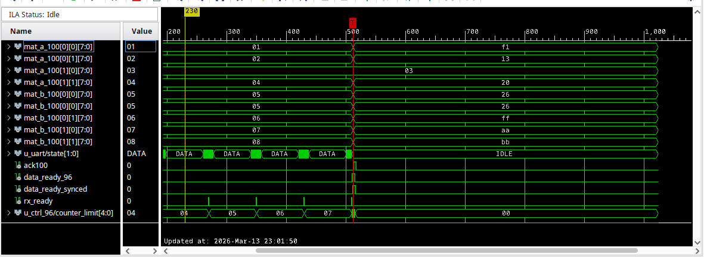
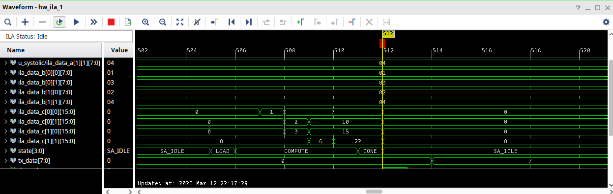
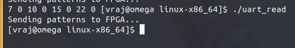

# FPGA-Based Systolic Array Accelerator

## Overview
This project implements a high-performance systolic array accelerator on a Basys 3 FPGA. The design receives matrix data from a PC via UART, performs matrix multiplication at 120 MHz, and transmits results back to the host.

To achieve a throughput of **1.2 MBPS**, the design uses the `ftd2xx` library to set a 12 MBaud rate with 8x oversampling achiver with a PLL at 96MHz.

## System Architecture
The system is divided into two asynchronous clock domains: a 96 MHz UART/Unpacker domain and a 120 MHz Compute domain. Data integrity between these domains is maintained via a 2-stage synchronizer handshake.

### Core Components
* **`top_unpacker` (96 MHz Domain)**: Handles interface logic, UART RX/TX, and the unpacking of serialized input streams.
* **`top_systolic` (120 MHz Domain)**: The high-speed processing core.
    * **`systolic_array`**: A grid of Processing Elements (PEs) executing optimized Multiply-Accumulate (MAC) operations.
    * **`feeder`**: Manages the orchestration of data into the array.
 
### System Hierarchy
```text
top
├── top_systolic
│     ├── control
│     └── compute
│           ├── systolic_array
│           │     └── PE
│           ├── feeder
│           └── D-FlipFlop
└── top_unpacker
      ├── contorl_unpack_96
      │    └── unpacker  
      ├── contorl_unpack_100
      └── two_stag_sync
```

## Control & Synchronization

### CDC Strategy
The Clock Domain Crossing (CDC) is managed using a robust handshake protocol where acknowledgment signals are passed through a two-stage synchronizer to ensure metastability is avoided.

When data_ready_96 asserts, the signal crosses the 2-stage synchronizer. Once data_ready_synced is high in the 120 MHz domain, the data is captured, an ack100 signal is sent back, and the counter resets for the next byte.

### State Machine Logic
The systolic array operation is controlled by an FSM that sequences the system through `IDLE`, `LOAD`, `COMPUTE`, and `DONE` states.


## Performance & Implementation
* **Target Device**: Basys 3 FPGA.
* **Timing Closure**: Achieved a Worst Negative Slack (WNS) of **0.171 ns** at 120 MHz.
* **Optimization**: Timing was optimized by setting a `max_fanout` of 64 on control signals (e.g., `rx_ready`) and utilizing pipeline registers (`D-FlipFlop`).

## Verification
The design was verified using hardware ILA captures, ensuring correct data flow from the PC, through the unpacker, into the systolic array, and back to the host.




---
