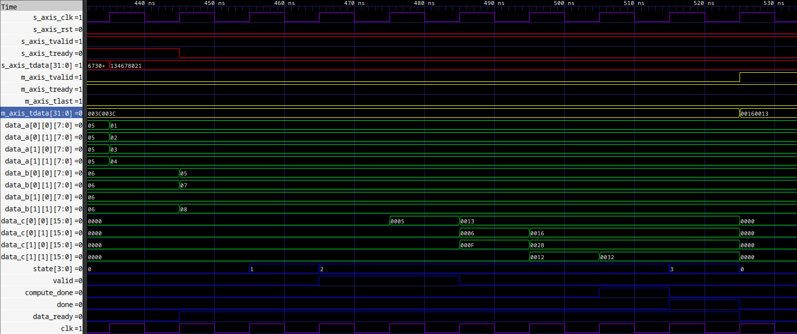
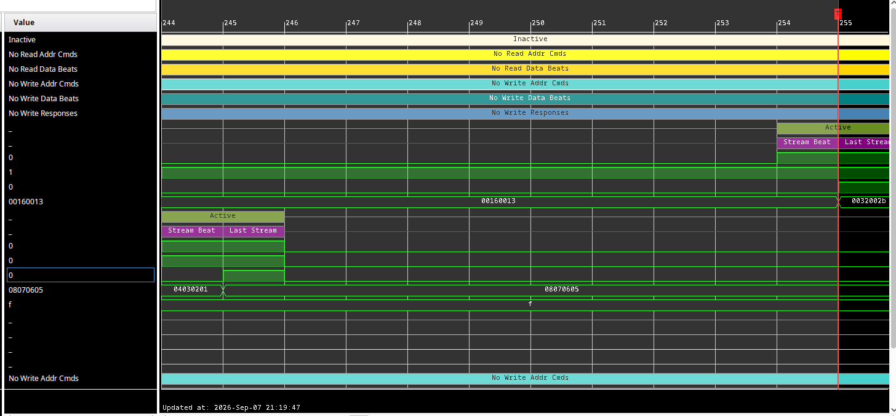
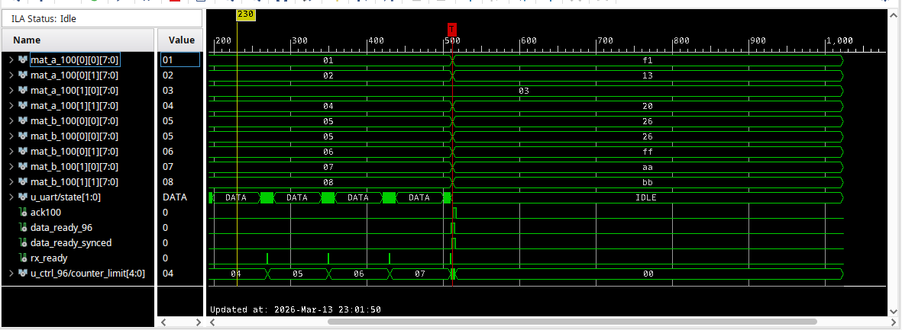
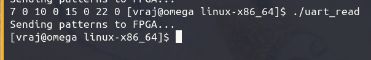

# Systolic Array

The project started as a basic systolic array connected to a custom UART at 12 MBaud on the Basys 3, to get data into the FPGA as fast as possible. In this phase, two matrices are sent row wise over UART in the 96 MHz domain and crossed into the 120 MHz domain with a 2 stage sync flip flop handshake. ILA waveform below.

Later, to extend this and learn AXI, I wrapped the UART module (built on an async FIFO) into an AXI-Stream interface and sent data through MicroBlaze V to a DMA stream back to the PC. After getting that working, I wrapped the systolic array itself with AXI-Stream input and output, connecting it to the DMA as a streaming accelerator. This gives a small fixed function hardware block connected to the DMA stream, where the CPU sends data by writing to memory and triggering the DMA, then reads the result back from the same BRAM.

The main motivation was to pair a systolic array with a CPU core. The CPU can arrange data in BRAM as needed, and either a DMA trigger or an AXI config register can kick off the systolic compute for larger matmuls.

This architecture can extend to other fixed function accelerators like FIR, FFT, and others. Right now it is streaming based, but it could also be made instruction based.

Throughput is 1.2 MBPS using the ftd2xx library at 12 MBaud with 8x oversampling, clocked by a PLL at 96 MHz.

With AXI-Stream on a 2x2 matrix, the array moves 32 bits every cycle at 100 MHz, completing the full result stream in 12 cycles, with a 5 cycle gap in between for the systolic compute itself. Compared to software matmul on MicroBlaze, software compute time increases with operand size while the systolic timing stays fixed.

---

## AXI4-Stream / MicroBlaze V SoC Integration

Extended the same 2x2 systolic array into a full SoC: MicroBlaze V, AXI DMA, and AXI4-Stream, instead of driving it directly over UART.


A bare-metal C driver arms the DMA in Simple mode, sends a packed matrix pair in, and polls for the result.

### Key Numbers

| Parameter | Value |
|---|---|
| Test configuration | 2x2 matrix |
| Fixed array compute latency | 12 cycles @ 100 MHz = 120 ns |
| DMA setup overhead (avg) | 5.78 us |
| Transfer + poll wait (avg) | 2.49 us |
| Total hardware round trip (avg) | 8.27 us |
| Speedup vs. software matmul | 1.19x to 1.76x, grows with operand magnitude |

### What I Found

**Array latency is fixed, software isn't.** The array takes exactly 12 cycles per matmul regardless of input values, confirmed by matching cycle count between Verilator sim and hardware ILA capture. MicroBlaze's software baseline uses a soft multiplier that takes more cycles for larger operands, so speedup over software grows with operand size (1.19x to 1.76x) even though the hardware never changes speed.



Top signals are the clocks. Red signals are AXI-Stream input, yellow is AXI-Stream output, green is internal data movement, blue below that is the systolic state transition. This matches the ILA capture from the Basys 3.

**DMA setup dominates at this payload size.** About 70% of the 8.27 us round trip is register setup, not data movement or compute. AXI4-Stream itself can move roughly 100 MB/s at this width and clock, but a 2x2 matmul only moves 16 bytes total, so fixed DMA setup cost swamps the actual transfer.

**16-bit accumulator overflow is verified, not a bug.** The output accumulator is 16 bits wide, so results wrap at 65536. Confirmed hardware and software wrap identically across the full 8-bit input range, including the exact overflow boundary (181 stays under the limit, 182 wraps).

**Batching doesn't work with the current wrapper.** The AXI-Stream wrapper asserts TLAST at the end of every pair, not just the last pair of a batch. DMA Simple mode treats one TLAST as the whole transfer being done, so a batched request only completes on the first pair. Fixing this needs the wrapper to only assert TLAST on the final pair and auto restart the FSM between pairs.

### Verification

Verified on hardware using Vivado ILA, capturing real AXI-Stream transactions between the DMA and the array.



- TDATA on the ILA capture matches expected packed input/output values
- Hardware output matches software output exactly across small, mid range, and near max 8-bit values, including overflow wraparound
- Repeatable across 100 and 1000 run counts

### Notes

- Only the 2x2 configuration was tested through this DMA path. The array itself scales to 16x16 (see UART-based results below), but that hasn't been re-verified through DMA yet
- The 2x2 version was used for early bringup and is still in the repo, it is simpler to debug on the ILA but the desing is fully scaleable.

---

## Original Systolic and UART design

The design splits into two clock domains:
- **96 MHz domain** handles UART RX/TX and unpacking the incoming byte stream
- **120 MHz domain** runs the systolic array and accumulates results

Data crosses the boundary via a 2-stage synchronizer handshake. When `data_ready_96` goes high it propagates through the synchronizer, gets captured in the 120 MHz domain, triggers an `ack100` back to the 96 MHz side, and resets the counter for the next byte.



The array itself is controlled by an FSM with four states: `IDLE -> LOAD -> COMPUTE -> DONE`.


---

## Module Hierarchy

```
top
├── top_systolic (120 MHz)
│     ├── control
│     └── compute
│           ├── systolic_array
│           │     └── PE (16x16 grid, DSP-backed MACs)
│           ├── feeder
│           └── D-FlipFlop (pipeline registers)
└── top_unpacker (96 MHz)
      ├── control_unpack_96
      │    └── unpacker
      ├── control_unpack_100
      └── two_stage_sync
```

## Key Numbers

| Parameter | Value |
|---|---|
| Array size | Max implemeted 16x16 |
| Compute clock | 120 MHz |
| UART clock | 96 MHz |
| UART baud rate | 12 MBaud |
| Throughput | 1.2 MBPS |
| WNS (after optimization) | +0.149 ns |
| Target device | Basys 3 (Artix-7) |

Timing started at WNS = -0.261 ns and closed at +0.149 ns. The main fix was setting `max_fanout = 64` on `rx_ready`, which was fanning out to 4097 endpoints and blowing the timing budget on those paths. Adding that line made a tree structure for Write enable singal.

## Verification

The design was verified on hardware using Vivado ILA. Captures confirm:



- Byte stream unpacking and state transitions (`IDLE -> LOAD -> COMPUTE -> DONE`) work correctly at full speed
- The CDC handshake holds: `data_ready_96` asserts, crosses the synchronizer, `ack100` fires back, counter resets cleanly
- Output values match expected results for both 2x2 and 16x16 test cases

---

## Repo Layout

```
src/           RTL source files (Verilog + VHDL)
systolic/      Constraints and Vivado project files
images/        ILA captures and timing screenshots
host/          PC-side UART program (C + ftd2xx)
axi_stream_microblaze_systolic/img/    Block design, ILA, and Verilator captures for the SoC integration
```
