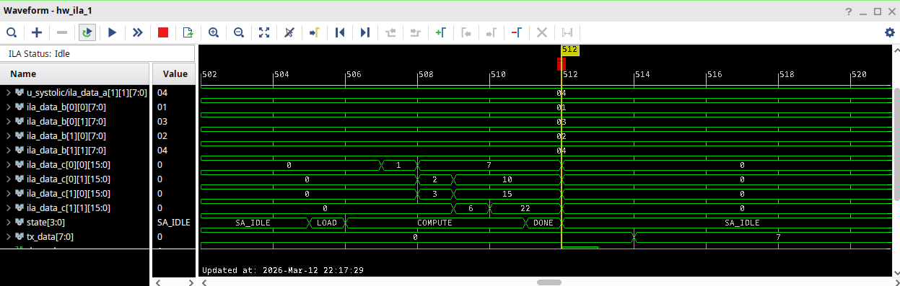
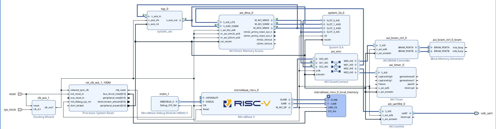

# Systolic Array Matrix Accelerator — Artix-7 FPGA

This project is a systolic array matrix multiplier built on a Basys 3
(Artix-7), developed across three stages: a UART-driven standalone array,
an AXI4-Stream/MicroBlaze SoC integration, and a double-buffered PE rework
for higher throughput. All three stages live on `main`, split by folder.

| Stage | Location | Status |
|---|---|---|
| v1 — UART / CDC array | `src/`, `images/`, `host/` | 16x16, hardware-verified |
| v2 — AXI DMA / MicroBlaze SoC | `axi_stream_microblaze_systolic/` | 2x2, hardware-verified |
| v3 — Double-buffered accumulator | [`TPU/`](./TPU) | 2x2 proof-of-concept, NxN generalization planned |

---

## v1 — UART / CDC Systolic Array

The project started as a basic systolic array connected to a custom UART
at 12 MBaud, to get data into the FPGA as fast as possible. Two matrices
are sent row-wise over UART in the 96 MHz domain and crossed into the
120 MHz compute domain with a 2-stage synchronizer handshake.

The array itself is controlled by a 4-state FSM: `IDLE -> LOAD -> COMPUTE -> DONE`.



**Key numbers**

| Parameter | Value |
|---|---|
| Array size | Up to 16x16 |
| Compute clock | 120 MHz |
| UART clock | 96 MHz |
| UART baud rate | 12 MBaud |
| Throughput | 1.2 MBPS |
| WNS (after optimization) | +0.149 ns (from -0.261 ns) |

Timing closed by setting `max_fanout = 64` on `rx_ready`, which was fanning
out to 4097 endpoints and blowing the timing budget on those paths.

Verified on hardware via Vivado ILA — byte unpacking, FSM transitions, and
the CDC handshake (`data_ready_96` → synchronizer → `ack100` → counter
reset) all confirmed at full speed, with output matching expected results
for both 2x2 and 16x16 test cases.

→ Source in [`src/`](./src), [`images/`](./images), [`host/`](./host)

---

## v2 — AXI4-Stream / MicroBlaze V SoC Integration

Extended the same array into a full SoC: MicroBlaze V, AXI DMA, and
AXI4-Stream, replacing direct UART control. A bare-metal C driver arms the
DMA in Simple mode, sends a packed matrix pair in, and polls for the
result.



**Key numbers**

| Parameter | Value |
|---|---|
| Test configuration | 2x2 matrix |
| Fixed array compute latency | 12 cycles @ 100 MHz = 120 ns |
| DMA setup overhead (avg) | 5.78 us |
| Transfer + poll wait (avg) | 2.49 us |
| Total hardware round trip (avg) | 8.27 us |
| Speedup vs. software matmul | 1.19x – 1.76x, grows with operand magnitude |

**What I found**

- **Array latency is fixed, software isn't.** The array takes exactly 12
  cycles per matmul regardless of input values, confirmed by matching
  cycle count between Verilator sim and hardware ILA capture. MicroBlaze's
  software baseline uses a soft multiplier that slows down with larger
  operands, so speedup over software grows with operand size.
- **DMA setup dominates at this payload size.** About 70% of the 8.27 us
  round trip is register setup, not data movement or compute — a 2x2
  matmul only moves 16 bytes, so fixed DMA overhead swamps the transfer.
- **16-bit accumulator overflow verified, not a bug.** Hardware and
  software wrap identically across the full 8-bit input range, including
  the exact overflow boundary.
- **Batching not yet supported.** The AXI-Stream wrapper asserts `TLAST`
  at the end of every pair rather than only the last pair of a batch, so
  DMA Simple mode completes after the first pair. Fixing this needs the
  wrapper to gate `TLAST` and auto-restart the FSM between pairs.

Only the 2x2 configuration has been tested through the DMA path — the
array itself scales to 16x16 (see v1), but that hasn't been re-verified
through DMA yet.

→ Source in [`axi_stream_microblaze_systolic/`](./axi_stream_microblaze_systolic)

---

## v3 — Double-Buffered Accumulator

Reworks the PE to add a double-buffered accumulator, removing the stall
between consecutive matrices. One bank keeps accumulating a new matrix's
partial sums while the other bank's finished result drains out.


**Key numbers**

| Parameter | Value |
|---|---|
| Test configuration | 2x2 matrix |
| Throughput improvement | ~2x (50% cycle reduction) in streaming mode |
| Status | Implemented and hardware-verified at 2x2; NxN generalization in progress |

The design staggers `switch` and `drain` control pulses diagonally across
the array so each PE fills one accumulator bank while the other drains —
eliminating the stall between consecutive matrix multiplies that a
single-buffered accumulator would otherwise incur.

→ Source in [`TPU/`](./TPU) · [Architecture deep dive](./TPU/README.md)

---

## Repo Layout

```
src/                                RTL source files (Verilog + VHDL)              [v1]
systolic/                           Constraints and Vivado project files           [v1]
images/                             ILA captures and timing screenshots            [v1]
host/                                PC-side UART program (C + ftd2xx)              [v1]
axi_stream_microblaze_systolic/     Block design, ILA, Verilator captures          [v2]
  └── img/
TPU/                                 Double-buffered PE, control, testbench, img/   [v3]
  ├── control_systolic.v
  ├── systolic.v
  ├── pe.v
  ├── tb.v
  └── img/
```
