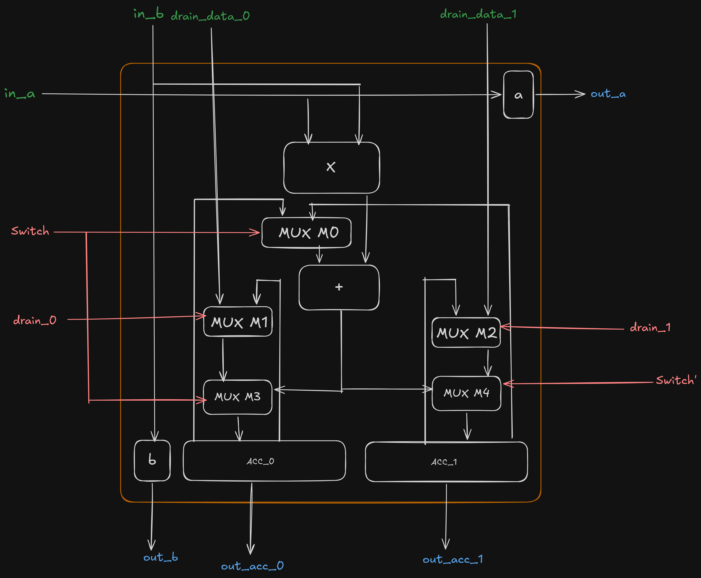
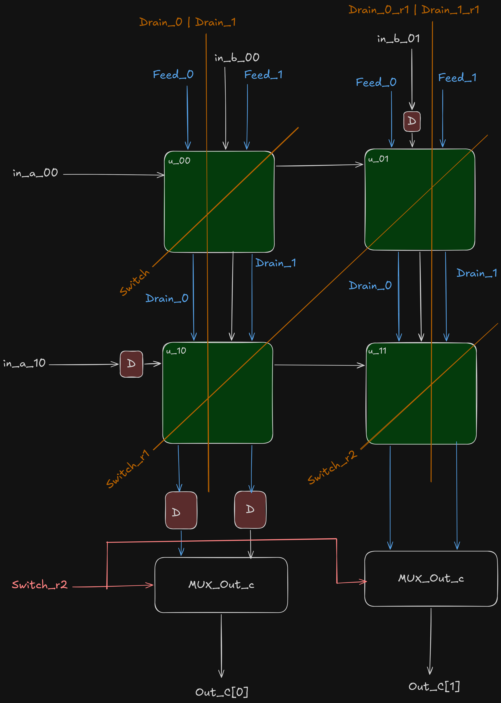

# Double-Buffer Systolic Array

This project extends the systolic array built in [Systolic Array](https://github.com/vraj0000/systolic_array). The
main improvement is a rework of the PE to add a double-buffered
accumulator, improving throughput.

## Processing Element



The internal MAC (multiply-accumulate) stays the same as the original
design. What changes is the input to the adder and where the result gets
stored, based on a small set of selection signals.

- **MUX M0** selects which accumulator (`ACC_0` or `ACC_1`) currently feeds
  the adder. The other bank holds its finished result until that column is
  ready to drain. During drain, a bias or zero can be injected into the
  accumulator through the `drain_data` port instead of the held result, if
  needed.
- **MUX M1/M3** (bank 0) and **MUX M2/M4** (bank 1) decide, per bank,
  whether it's storing a new partial sum or draining its held result:

```verilog
if (switch) begin
    acc_0 <= pe_sum;                                   // bank 0 fills
    acc_1 <= drain_1 ? drain_data_1 : acc_1;            // bank 1 drains (or holds)
end else begin
    acc_1 <= pe_sum;                                   // bank 1 fills
    acc_0 <= drain_0 ? drain_data_0 : acc_0;            // bank 0 drains (or holds)
end
```

This lets one bank keep accumulating a new matrix's partial sums while the
other bank's finished result drains out. That's what removes the stall
between consecutive matrices.

## Switch/Drain Timing Across the Array



The hard part of this design is staggering the `switch` and `drain` pulses
correctly across the rows and columns of the array, so every PE acts on the
right data at the right cycle. This design uses a 2x2 array (`u_00`/`u_01`
top row, `u_10`/`u_11` bottom row), but the same staggering pattern scales
to an N x N array.

As with any systolic array, inputs must be staggered on entry, and outputs
staggered on exit so results line up correctly. This can be done with
generate logic, producing a ladder-like delay structure across rows and
columns.

- `switch`, `drain_0`, and `drain_1` are each generated once by the control
  unit, then shifted diagonally into the array through delay elements
  between rows and columns.
- `switch` toggles every N cycles (2 cycles for this 2x2 array). It enters
  at `u_00` and propagates as a wavefront, right along with the `a`
  operand, down along with the `b` operand.
- `drain` is generated by the control unit on the same N-cycle period, but
  propagates column-wise through delay units outside the systolic core, and
  has to be applied to an entire column at once for the drain to work
  correctly.
- At the output, a mux selects which accumulator bank currently holds the
  valid result for `C`.

This keeps compute going continuously and increases throughput. A new
matrix can start filling one bank while the previous matrix's result drains
from the other, with no stall in between.

## Control Interface

`control_systolic` takes the number of matrix multiplications to perform,
along with rows of `A` and `B`, and outputs rows of `C`. Draining happens
from the bottom row upward, so higher rows come out first, followed by
lower rows.

The `num_matrix` input is there so the array can eventually be fed by a
FIFO on the input side, with an output FIFO (or an address-generator unit)
writing results directly to memory. `a_ready`/`b_ready` are already in
place for that: rows of `A`/`B` would be continuously pushed into an input
FIFO, and the array would pass results downstream as rows become
available. The output side would then need to apply back-pressure so
draining only proceeds once downstream is ready to accept it.

The FIFO and back-pressure integration itself is planned, not yet built in
this repo.

## Repo Layout

```
control_systolic.v   Control signals and top-level systolic interface
systolic.v            PE interconnect, plus delay/staging units for drain and switch
pe.v                  Individual processing element
tb.v                  Basic testbench applying inputs

axi_stream_microblaze_systolic/img/   Block design, ILA, and Verilator
                                        captures from the SoC integration
```
