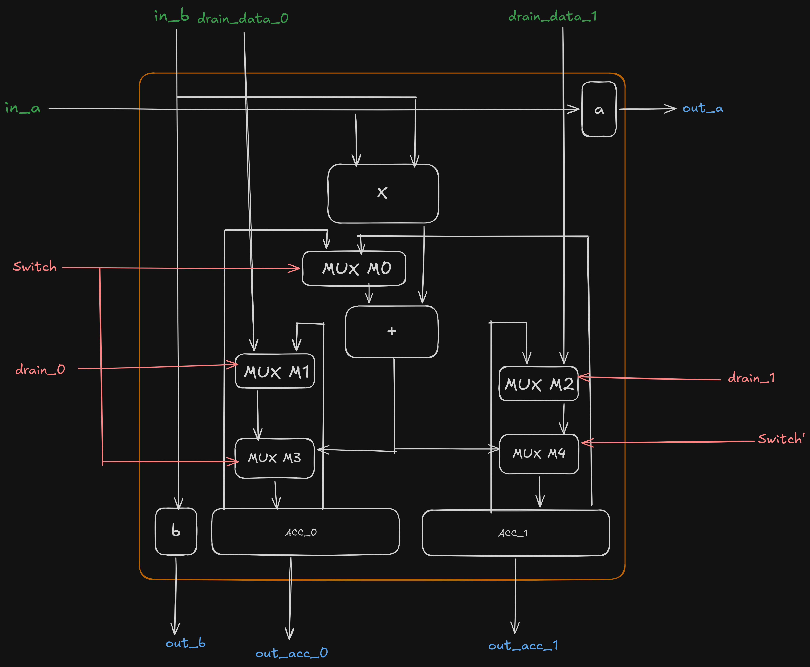
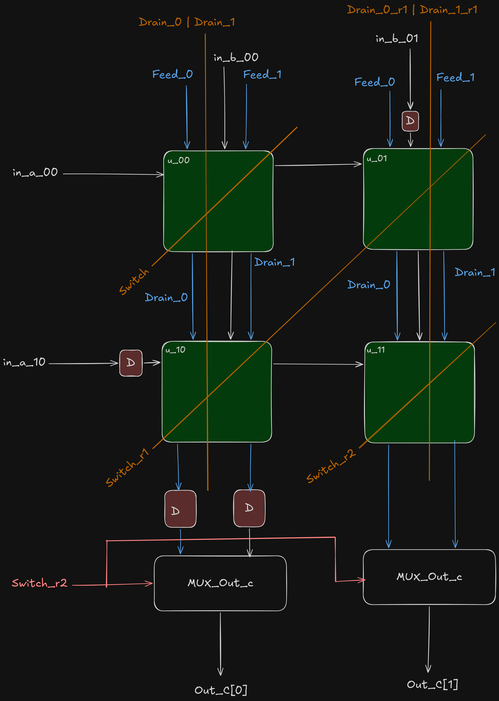

# Double-Buffer Systolic Array

This project builds on my earlier [Systolic Array](https://github.com/vraj0000/systolic_array). The main change is in the PE. It now has two accumulators instead of one, so the array can start on the next matrix while the previous result is still draining out. This removes the stall between matrices and improves throughput.

## Processing Element



The multiply-accumulate part of the PE is the same as the original design. What changed is which accumulator feeds the adder and where the result is stored.

- **MUX M0** picks which accumulator (`ACC_0` or `ACC_1`) feeds the adder. The other one keeps its finished result until its column is ready to drain. During drain, a bias or zero can be loaded into the accumulator through the `drain_data` port.
- **MUX M1/M3** (bank 0) and **MUX M2/M4** (bank 1) decide whether each bank stores a new partial sum or drains its result.

```verilog
if (switch) begin
    acc_0 <= pe_sum;                                   // bank 0 fills
    acc_1 <= drain_1 ? drain_data_1 : acc_1;            // bank 1 drains (or holds)
end else begin
    acc_1 <= pe_sum;                                   // bank 1 fills
    acc_0 <= drain_0 ? drain_data_0 : acc_0;            // bank 0 drains (or holds)
end
```

While one bank adds up partial sums for the new matrix, the other bank drains the finished result of the previous one.

## Switch and Drain Timing



The tricky part of this design is timing the `switch` and `drain` signals so each PE acts on the right data at the right cycle. The design is a 2x2 array (`u_00` and `u_01` on the top row, `u_10` and `u_11` on the bottom row), but the same pattern works for an N x N array.

Like any systolic array, inputs have to be staggered going in and outputs staggered coming out. This is done with generate logic that builds a ladder of delays across rows and columns.

- The control unit generates `switch`, `drain_0`, and `drain_1` once. Delay elements then pass them through the array.
- `switch` toggles every N cycles (every 2 cycles here). It enters at `u_00` and moves right with the `a` input and down with the `b` input.
- `drain` has the same N-cycle period, but it moves column by column through delay units outside the array. It has to reach a whole column at once for the drain to work.
- At the output, a mux picks the accumulator bank that holds the valid result for `C`.

## Control Interface

`control_systolic` takes the number of matrix multiplications to run, along with rows of `A` and `B`, and outputs rows of `C`. Draining starts at the bottom row and moves upward, so higher rows come out first, followed by lower rows.

The `num_matrix` input is there so the array can later be fed from an input FIFO, with an output FIFO or address generator writing results to memory. The `a_ready` and `b_ready` signals are already in place for this. The output side would also need back-pressure so draining only happens when the next stage is ready.

The FIFO and back-pressure parts are planned but not built yet.

## cocotb Verification

The design is tested with cocotb and a Python golden model. The test generates a random number of matrices with random values, sends them through the array, and checks every output against the golden model.

```
  +++++++++++ Starting the 2 x 2 Double Buffer Multiplication +++++++++
    20.00ns INFO     test                               Number of Randomly Generated Matrix = 18
   430.00ns INFO     test                               All Values are True !!!!!!!
   430.00ns INFO     test                               First input at 20.0ns, first output at 80.0ns
   430.00ns INFO     test                               Latency = 6 cycles
   430.00ns INFO     test                               First input at 20.0ns, last output at 410.0ns
   430.00ns INFO     test                               Latency = 41 cycles
   430.00ns INFO     cocotb.regression                  test_systolic.systolic_compute passed
   430.00ns INFO     cocotb.regression                  ****************************************************************************************
                                                        ** TEST                            STATUS  SIM TIME (ns)  REAL TIME (s)  RATIO (ns/s) **
                                                        ****************************************************************************************
                                                        ** test_systolic.systolic_compute   PASS         430.00           0.04      11992.52  **
                                                        ****************************************************************************************
                                                        ** TESTS=1 PASS=1 FAIL=0 SKIP=0                  430.00           0.04      11793.05  **
                                                        ****************************************************************************************
```

The latency for one result is the same as the original 2x2 design. Throughput goes up because data can be sent into the array continuously.

## Repo Layout

```
control_systolic.v    Control signals and top-level interface
systolic.v            PE connections, plus delay units for drain and switch
pe.v                  Single processing element
tb.v                  Basic testbench
cocotb/
    golden_model.py   Python model that computes the expected output
    test_systolic.py  Runs the Verilog design and compares results
    Makefile          Builds with Verilator and runs the cocotb test

axi_stream_microblaze_systolic/img/   Block design, ILA, and Verilator
                                      captures from the SoC integration
```
